---

# OCS Project (Online Charging System)

**Description:**
A distributed, microservice-based Online Charging System (OCS) designed for real-time telecommunications billing. Built with Spring Boot, Kafka, Hazelcast, and Kubernetes for scalability, resilience, and high availability.

---

## Overview

The **OCS Project** (Online Charging System) is a distributed, scalable telecommunications solution that handles real-time charging for services like voice, SMS, and data. The architecture includes microservices, distributed caching, containerization, and automated deployment.

## Architecture

**Main Components:**

* **Diameter Gateway (DGW)** – Diameter message handling with Akka Cluster.
* **Charging Gateway Function (CGF)** – Business rule application and event processing.
* **Account Order Management (AOM)** – Manages user accounts and orders.
* **Account Balance Management Function (ABMF)** – Manages balances and top-ups.
* **Notification Framework (NF)** – Sends real-time notifications.
* **Traffic Generator Function (TGF)** – Generates synthetic traffic for testing and validation.
* **Mobile App** – End-user application.

**Microservices use:**

* **Spring Boot**
* **Kafka** & **Kafdrop**
* **Hazelcast Cluster**
* **Apache Ignite**
* **Docker & Kubernetes**

## 🗂 System Design

### Architectural Design

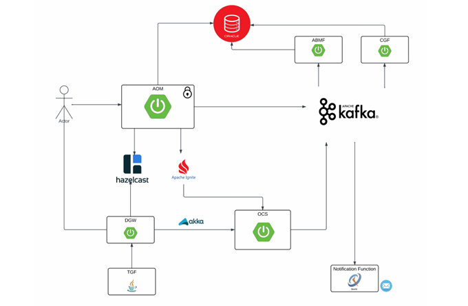

### Database Design

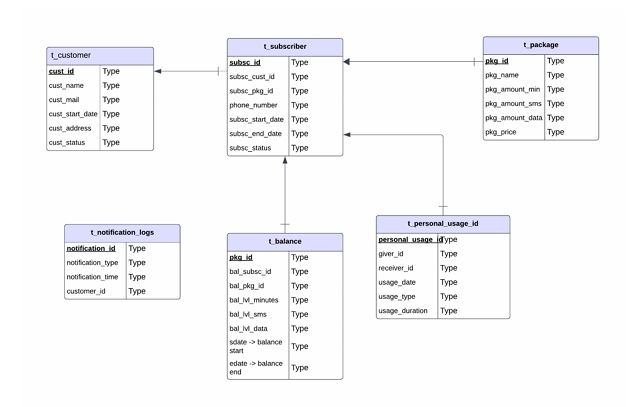

### Use Case Diagram

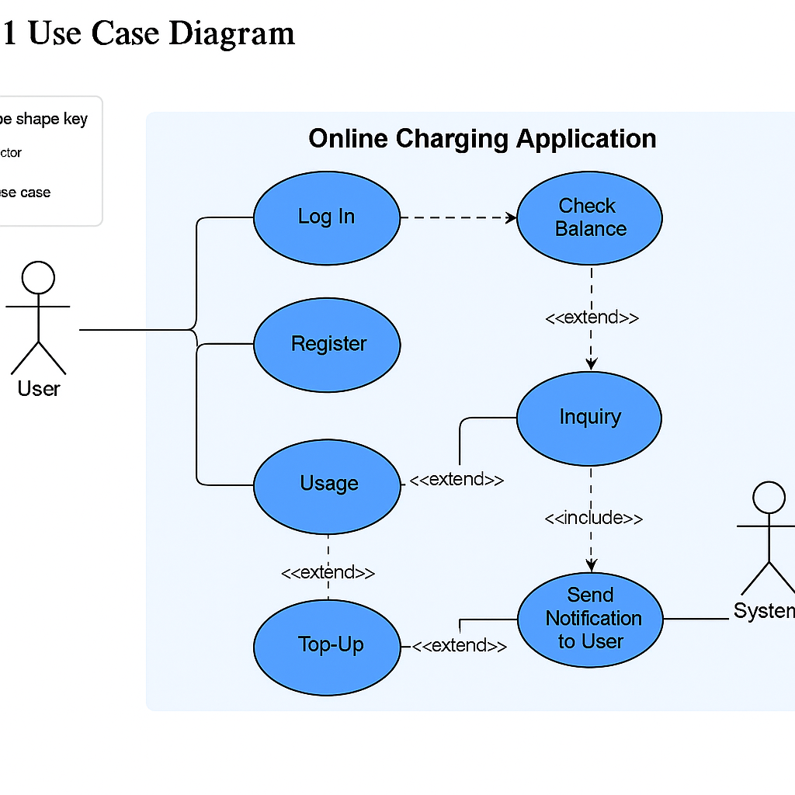

## Modules and Their Diagrams

---

### **Diameter Gateway (DGW)**

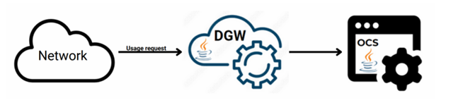
**Function:** Receives network traffic and performs user authentication using Hazelcast. If the subscriber exists, forwards usage data to the OCS using Akka actors.

---

### **Charging Gateway Function (CGF)**

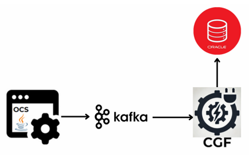
**Function:** Consumes general usage events from Kafka and logs detailed records into the database.

---

### **Account Order Management (AOM)**

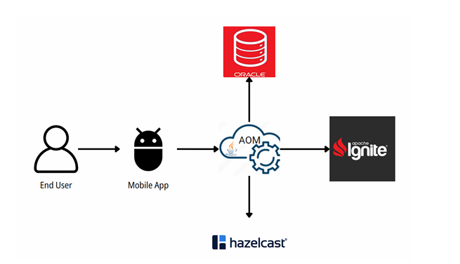
**Function:** Manages user and package balance information. Stores and manages data across three databases: Ignite, Hazelcast, and Oracle DB.

---

### **Account Balance Management Function (ABMF)**

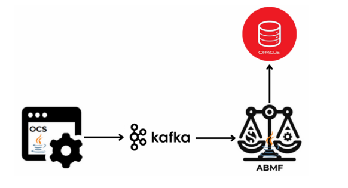
**Function:** Reads balance data from Kafka and synchronizes persistent records with Ignite database.

---

### **Notification Framework (NF)**

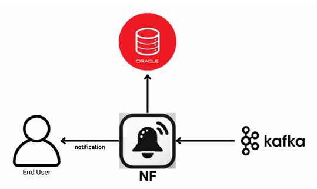
**Function:** Listens for Kafka triggers and sends user notifications for events like 80% usage or overages.

---

### **Traffic Generator Function (TGF)**

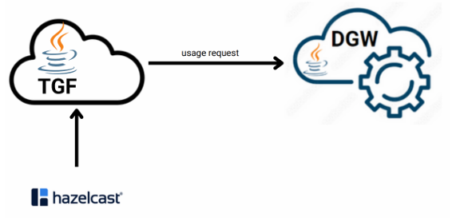
**Function:** Generates synthetic traffic and sends it to the DGW for system testing and validation.

---

### **Mobile App**

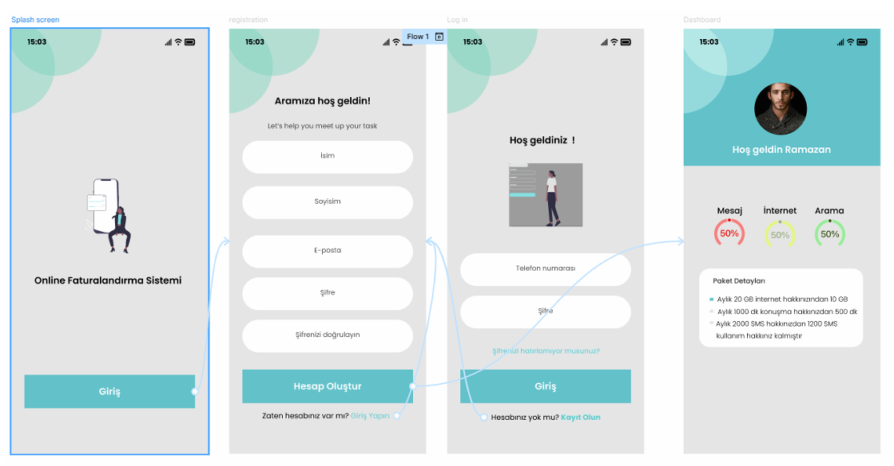
**Function:** Provides user interface for balance checks, top-ups, and usage monitoring.

---

## 🔄 CI/CD Pipeline

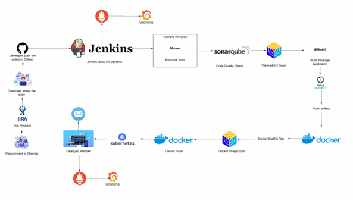

*Describes the continuous integration and deployment workflow from development to production.*

---

## ⚙ Technologies

* **Java 17** / **Spring Boot**
* **Hazelcast / Ignite / Kafka**
* **Docker / Kubernetes**
* **Akka Cluster**
* **PostgreSQL / MongoDB** *(if applicable to DB design)*

## ✅ Development Principles

* Business logic isolated in **service layers**.
* Lightweight **controllers**.
* Follows **SOLID** and **clean architecture**.
* GOAL : Automated testing and containerized deployment.

## 🔍 Monitoring

* **Hazelcast Management Center**
* **Ignite Dashboard**
* **Kafdrop** for Kafka topic inspection.

## 📜 License

MIT License.

---

